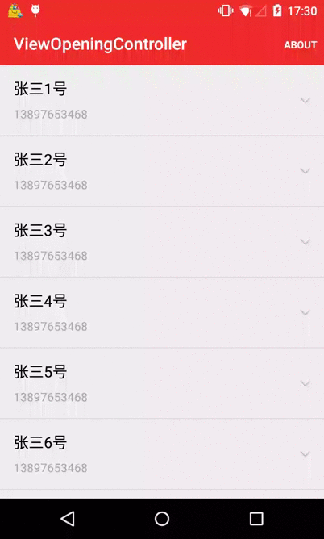

# ViewExpander

![Platform][platform_image]
[![API][min_api_image]][min_api_link]
[![Release Version][release_version_image]][release_version-link]

ViewExpander 用来快速实现 View 展开关闭效果，使用非常简单，适用于所有的 View



## 开始使用

### 1. 导入 ViewExpander

在 app 的 build.gradle 文件的 dependencies 节点中加入依赖

```groovy
dependencies{
	implementation 'me.panpf:view-expander:$lastVersionName'
}
```

请自行替换 `$lastVersionName` 为最新的版本：[![Release Version][release_version_image]][release_version-link] `（不要v）`

最低支持 `Android 2.3`

### 2. 在 Adapter 中使用

在数据对象中定义保存展开/折叠状态的字段

```java
public class User {
    ...
    private boolean expended;
    ...
    public boolean isExpended() {
        return opened;
    }

    public void setExpended(boolean expended) {
        this.expended = expended;
    }
}
```

在 ViewHolder 中定义 ViewExpander

```java
private static class ViewHolder{
    ...
    private ImageView openStatusImageView;
    private View openAreaView;
    private ViewExpander viewExpander;
    private User user;
}
```

在 getView 方法中初始化 ViewExpander 以及相应的事件设置

```java
@Override
public View getView(int position, View convertView, ViewGroup parent) {
    if (convertView == null) {
        convertView = LayoutInflater.from(context).inflate(R.layout.list_item_user, parent, false);
        final ViewHolder viewHolder = new ViewHolder();
        ...
        viewHolder.openStatusImageView = (ImageView) convertView.findViewById(R.id.image_userItem_openStatus);
        viewHolder.openAreaView = convertView.findViewById(R.id.layout_userItem_openArea);
        convertView.setTag(viewHolder);

	// 创建 ViewExpander，并指定要展开关闭的 View
	// 你还需要实现其 setViewStatus(boolean) 方法，根据 opened 参数修改你要展开关闭的 View
        viewHolder.viewExpander = new ViewExpander(viewHolder.openAreaView) {
            @Override
            public void setViewStatus(boolean expanded) {
                viewHolder.openAreaView.setVisibility(expanded ? View.VISIBLE : View.GONE);
                viewHolder.openStatusImageView.setImageResource(expanded ? R.drawable.ic_arrow_up : R.drawable.ic_arrow_down);
            }
        };

	// 监听 convertView 的点击事件，调用 viewExpander.opening(boolean) 方法展开或关闭
        convertView.setOnClickListener(new View.OnClickListener() {
            @Override
            public void onClick(View v) {
                ViewHolder viewHolder1 = (ViewHolder) v.getTag();
                User user = viewHolder1.user;
                user.setExpended(!user.isExpended());
                viewHolder1.viewExpander.expand(user.isExpended());
            }
        });
    }

    ViewHolder viewHolder = (ViewHolder) convertView.getTag();
    User user = userList.get(position);
    ...

    // 重置 viewExpander 的状态
    viewHolder.viewExpander.measureViewHeightAndInit(user.isExpended());
    viewHolder.user = user;

    return convertView;
}
```

注意：
* 展开区域的布局跟其它区域之间的间隔不能用 margin 实现，因为这样在切换的过程中会有明显的卡顿
* 展开区域内的子 View 最好是贴着底部的，例如使用 android:layout_gravity="bottom" 属性，并且子 View 的高度必须是写死的，这样在变化的过程中会比较自然
* measureViewHeightAndInit() 方法返回 false 的话就说明展开和折叠时高度一样的，就不需要再使用 ViewExpander 了

更详细的内容请参考 sample 源码

## License
    Copyright (C) 2017 Peng fei Pan <sky@panpf.me>

    Licensed under the Apache License, Version 2.0 (the "License");
    you may not use this file except in compliance with the License.
    You may obtain a copy of the License at

      http://www.apache.org/licenses/LICENSE-2.0

    Unless required by applicable law or agreed to in writing, software
    distributed under the License is distributed on an "AS IS" BASIS,
    WITHOUT WARRANTIES OR CONDITIONS OF ANY KIND, either express or implied.
    See the License for the specific language governing permissions and
    limitations under the License.


[platform_image]: https://img.shields.io/badge/Platform-Android-brightgreen.svg
[min_api_image]: https://img.shields.io/badge/API-10%2B-orange.svg
[min_api_link]: https://android-arsenal.com/api?level=10
[release_version_image]: https://img.shields.io/github/release/panpf/view-expander.svg
[release_version-link]: https://github.com/panpf/view-expander/releases
